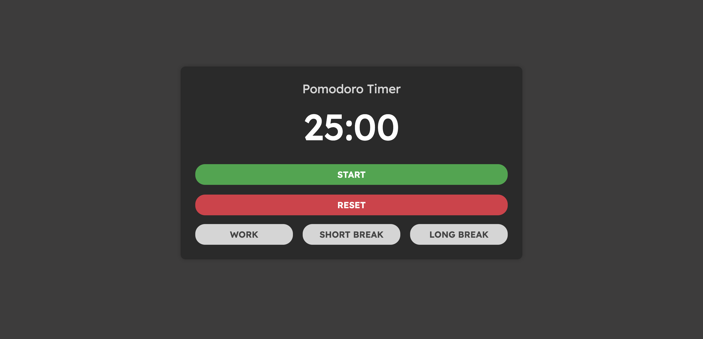
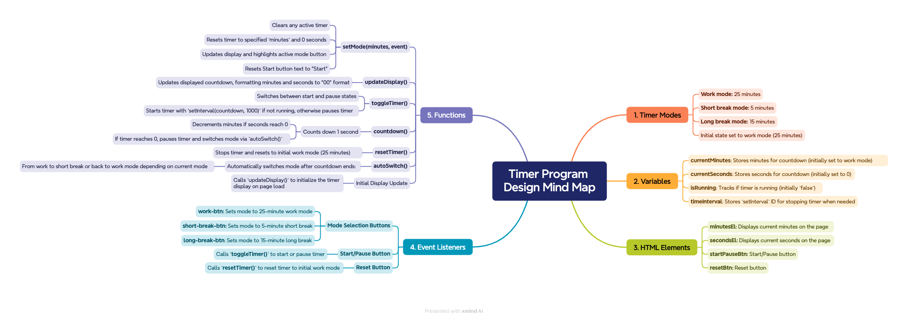

# Pomodoro Timer

A Pomodoro Timer web application built using HTML, CSS, and JavaScript. This tool is designed to enhance productivity by helping users break work into intervals separated by short and long breaks.

## Features

- **Pomodoro Timer**: 25-minute work sessions with short (5 min) and long (15 min) breaks.
- **Responsive Design**: Clean and simple UI with adaptable layout.
- **Mode Selection**: Switch between work, short break, and long break modes easily.

## Demo

Click [here](https://skylaryhu.github.io/js-pomodoro-timer/) to view the demo

## Screenshot

## Mindmap
